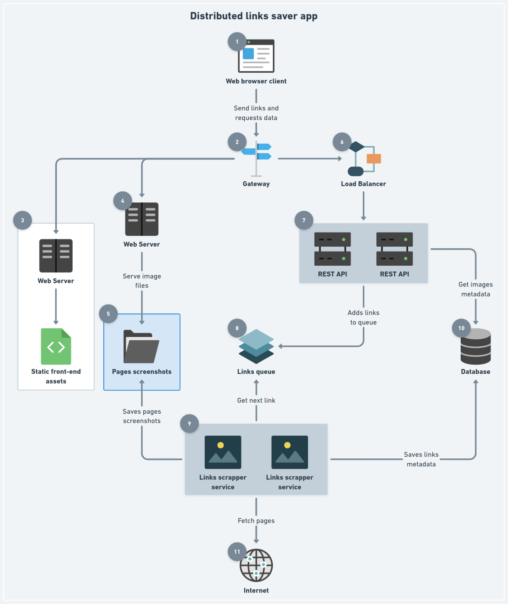

# Distributed Links Saver App

Este projeto é uma aplicação distribuída que realiza _web scraping_ de links enviados pelos usuários, salvando os metadados e uma imagem prévia da página.

## Arquitetura e Tecnologias



1. Front-end Web App (React)
2. Gateway (Nginx)
3. Front-end Web Server (Nginx)
4. Images Web Server (Nginx)
5. Images Persistence Storage (Volume)
6. Load Balancer (Nginx)
7. REST API (Node.js)
8. Message Broker (RabbitMQ)
9. Web Scraper Worker (Node.js)
10. Database (PostgreSQL)
11. Internet

## Como executar o projeto

### Pré-requisitos

- Docker (https://docs.docker.com/)
- Docker Compose V2 (https://docs.docker.com/compose/)

### Etapas para execução

1. Clone o repositório:

```sh
git clone <repo-url>
```

2. Entre na pasta do projeto:

```sh
cd distributed-links-saver
```

3. Execute os serviços:

```sh
docker compose up --build
```

4. Acesse a aplicação em [http://localhost](http://localhost:80).
